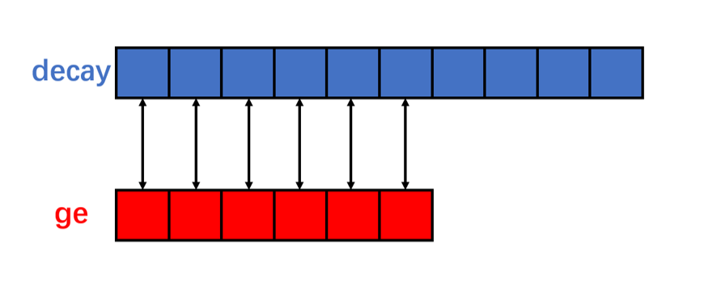

# [AGAFA-data-analysis](https://github.com/zhihuanli/AGAFA-data-analysis)

  - 1. [Online 程序解读](jupyter/Program.ipynb)
  - 2. [DSSD cross-talk introduction](jupyter/Cross_talk.ipynb)
  - 3. [关联程序](correlation)
  - 3. [关联程序(new)](correlation_new)
  - 4 ROOT Draw & Scan 中的坑
    - 绘制关联图或以某一变量作为条件绘制另外一个变量，当两个变量为数组时，ROOT会自动将变量按顺序进行一一匹配，匹配过程中以最小维度作为点数，忽略较长变量的多余数据
           
